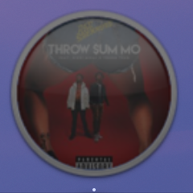

# spotifyAB - [Download](https://github.com/w0lfschild/spotifyAB/raw/master/build/spotifyAB.zip)

 

# Information:

- spotifyAB is a SIMBL plugin that adds some features to the Spotify desktop player
    - Change the dock icon to the now playing track art (three options)
        - Square
        - Tilted square
        - Circular
    - Automatically mute audio ads
    - Automatically mute audio ads (disabled by default)
    - Block banner ads (disabled by default + requires password to toggle)
    - Add badge to app icon when muted
    - Controls located in Playback menu
- Author: [w0lfschild](https://github.com/w0lfschild)

# Installation:

1. Install [SIMBL](https://github.com/w0lfschild/SIMBLPlugins/raw/master/SIMBLInstaller/SIMBLInstaller.zip)
2. Download [spotifyAB bundle](https://github.com/w0lfschild/spotifyAB/raw/master/build/spotifyAB.zip)
3. Unzip download
4. Copy to ``/Library/Application Support/SIMBL/Plugins``
5. Restart Spotify to have spotifyAB plugin loaded

### License:
Pretty much the BSD license, just don't repackage it and call it your own please!    
Also if you do make some changes, feel free to make a pull request and help make things more awesome!
